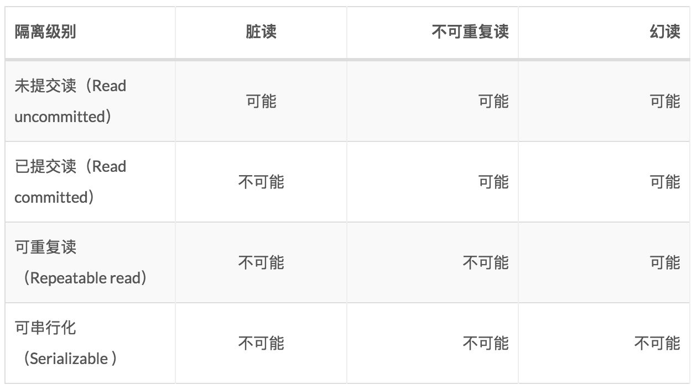

[toc]

# 事务

## 事务简介

> ​	事务: 
> ​		是一组操作的集合，它是一个不可分割的工作单位。
> ​		事务会把所有的操作作为一个整体一起向系统提交或撤销操作请求。
> ​		即这些操作要么同时成功，要么同时失败。
>
> ​	注意： 
> ​		默认 MySQL 的事务是自动提交的。
> ​		也就是说，当执行完一条 DML 语句时，MySQL 会立即隐式的提交事务。

## 事务的操作

> ​	MySQL 中，事务默认是隐式事务，在执行 `insert、update、delete` 等操作时，数据库自动开启事务、提交或回滚事务。
>
> ​	是否开启隐式事务是由变量 `autocommit` 控制的。
> ​	即，事务分为 <u>隐式事务</u> 和 <u>显示事务</u>。

### 隐式事务

> ​	事务自动开启、提交或回滚，比如 insert、update、delete 语句，事务的开启、提交或回滚由 MySQL 内部自动控制的。

```mysql
show variables like 'autocommit';
# 查看变量 autocommit 是否开启了自动提交。
# autocommit 值为 on 表示开启了自动提交。
```

### 显示事务

> ​	事务需要手动开启、提交或回滚，由开发者自己控制。

#### 方式一：设置手动提交

##### 1. 查看 / 设置事务提交方式

```mysql
select @@autocommit;

set @@autocommit = 0;
```

##### 2. 提交事务

```mysql
commit;
```

##### 3. 回滚事务

```mysql
rollback;
```

#### 方式二：transaction

##### 1. 开启事务

```mysql
start transaction / begin;
```

##### 2. 提交事务

```mysql
commit;
```

##### 3. 回滚事务

```mysql
rollback;
```

### 只读事务(了解)

> ​	表示在事务中执行的是一些只读操作，如查询，但是不会做 `insert、update、delete` 操作，数据库内部对只读事务可能会有一些性能上的优化。

```mysql
start transaction read only;
```

### savepoint 关键字

> ​	使用 savepoint 关键字，可以回滚至某一处，而不用回滚至事务开始状态。

```mysql
savepoint point1;
```

## 事务的四大特性(ACID)

- **原子性（Atomicity）：**事务是不可分割的最小操作单元。要么全部成功，要么全部失败。

- **一致性（Consistency）：**事务完成时，必须使所有的数据都保持一致状态。

- **隔离性（Isolation）：**数据库系统提供的隔离机制，保证事务在不受外部并发操作影响的独立环境下运行。

- **持久性（Durability）：**事务一旦提交或回滚，它对数据库中的数据的改变就是永久的。

## 并发事务的问题

> ​	A 事务与 B 事务，在同时操作同一数据库 / 同一张表时，所引发的一些问题。

| 问题                 | 说明                                                         |
| -------------------- | ------------------------------------------------------------ |
| 脏读(无效数据的读出) | 一个事务读到另外一个事务还没有提交的数据。未提交意味着这些数据可能会回滚，也就是可能最终不会存到数据库中，也就是不存在的数据。 |
| 不可重复读           | 一个事务先后读取同一条记录，但两次读取的数据不同，称之为不可重复读。 |
| 幻读                 | 一个事务按照条件查询数据时，没有对应的数据行，但是在插入数据时，又发现这行数据。 |

## 事务的隔离级别

> 注意：
> 	事务隔离级别越高，数据越安全，但是性能越低。
>
> ​	MySQL 默认为 `Repeatable read` 级别。



### 查看事务的隔离级别

```mysql
select @@tx_isolation;
SELECT @@TRANSACTION_ISOLATION; # MySQL8
```

### 设置事务的隔离级别

```mysql
set [session | global] transaction isolation level {read uncommitted | read committed | repeatable read | serializable};
```

### 隔离级别的选择

1. 需要对各种隔离级别产生的现象非常了解，然后选择的时候才能游刃有余。
2. 隔离级别越高，并发性也低。
   比如：最高级别`SERIALIZABLE`会让事物串行执行。并发操作变成串行了，会导致系统性能直接降低。
3. 具体选择哪种需要结合具体的业务来选择。
4. 读已提交（READ-COMMITTED）通常用的比较多。
