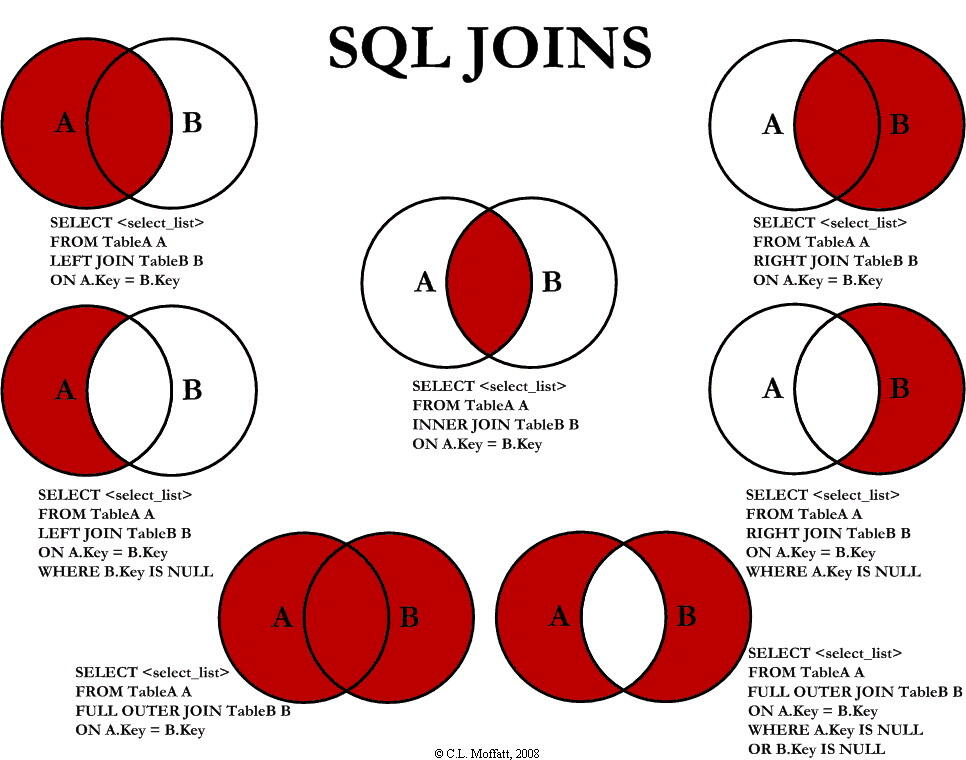

[toc]

# 多表查询

## 多表关系

> ​	在进行数据表结构设计时，会根据业务需求及求及业务模块之间的关系，分析并设计表结
>
> 构。由于业务之间相互关联，所以各个表结构之间也存在着各种联系，基本上分为三种：

- 一对多(多对一)

- 多对多

- 一对一

## 多表查询概述

> ​	多表查询就是指从多张表中查询数据。
>
> ​	原来查询单表数据时，执行的 SQL 形式为: `select * from emp;`
>
> ​	而执行多表查询时，就只需要使用逗号分隔多张表即可，如: `select * from emp, dept;`



### 多表查询分类：

#### 连接查询

- 内连接(Inner Join)：相当于查询 A, B 交集部分的数据。
- 外连接：
  - 左外连接(Left Join)：查询左表中所有的数据，以及两张表交集部分的数据。
  - 右外连接(Right Join)：查询右表中所有的数据，以及两张表交集部分的数据。
- 自连接：当前表与自身的连接查询，自连接必须使用表别名。

#### 子查询

- 子查询(Sub Query)，又称内查询(Inner Query)，或嵌套查询(Nested Query)：一个查询语句嵌套在另一个查询语句内的查询。

## 内连接

> ​	内连接查询的是两张表交集部分的数据。

### 语法

#### 隐式内连接

```mysql
select field_list from table1, table2 where 条件;
```

#### 显式内连接

```mysql
select field_list from table1 [inner] join table2 on 连接条件 ...;
```

### 示例

```mysql
# 查询每一个员工的姓名, 及关联的部门的名称
# 隐式内连接
SELECT emp.name AS '姓名', dept.name AS '部门名称' FROM emp, dept WHERE emp.dept_id = dept.id;

# 显式内连接
SELECT e.name, d.name 'dept_name' FROM emp e INNER JOIN dept d ON e.dept_id = d.id;
```

## 外连接

> ​	左外连接和右外连接是可以相互替换的，只需要调整在连接查询时 SQL 中表结构的先后顺
>
> 序就可以了。
>
> ​	而我们在日常开发使用时，更偏向于左外连接。

### 左外连接

> ​	左外连接相当于查询表1(左表)的所有数据，当然也包含表1和表2交集部分的数据。

```mysql
select field_list from table1 left [outer] join table2 on 条件 ...;
```

### 右外连接

> ​	右外连接相当于查询表2(右表)的所有数据，当然也包含表1和表2交集部分的数据。

```mysql
select field_list from table1 right [outer] join table2 on 条件 ...;
```

### 示例

```mysql
# 查询 emp 表的所有数据, 和对应的部门信息（左外连接）
SELECT e.*, d.name FROM emp e LEFT JOIN dept d ON e.dept_id = d.id;

# 查询 dept 表的所有数据, 和对应的部门信息（左外连接）
SELECT * FROM emp e RIGHT JOIN dept d ON e.dept_id = d.id;
SELECT * FROM dept d LEFT JOIN emp e ON e.dept_id = d.id;
```

## 自连接

### 自连接查询

> ​	自连接查询: 就是自己连接自己，也就是把一张表连接查询多次。
>
> ​	于自连接查询，可以是内连接查询，也可以是外连接查询。
>
> ​	注意事项:
> ​		在自连接查询中，必须要为表起别名，要不然我们不清楚所指定的条件、返回的字段，到底是哪一张表的字段。

```mysql
select field_list from table1 别名1 join table1 别名2 on 条件 ...;
```

#### 示例

```mysql
# 查询员工 及其 所属领导的名字
select a.name , b.name from emp a , emp b where a.managerid = b.id;
```

### 联合查询(union)

> ​	联合查询: 就是把多次查询的结果合并起来，形成一个新的查询结果集。
>
> ​	注意事项：
>
> ​		1.对于联合查询的多张表的列数必须保持一致，字段类型也需要保持一致。
>
> ​		2.`union all` 会将全部的数据直接合并在一起，`union` 会对合并之后的数据去重。

```mysql
select field_list from table1 ...
union [all]
select field_list from table2 ...
```

#### 示例

```mysql
select * from emp where salary < 5000 
union 
select * from emp where age > 50;
```

## 子查询

> ​	SQL 语句中嵌套 `SELECT` 语句，称为嵌套查询，又称子查询。
>
> ​	子查询外部的语句可以是 `INSERT / UPDATE / DELETE / SELECT` 的任何一个。

```mysql
select * from t_name1 where column1 = (select column1 from t_name2);
```

### 子查询分类：

#### 根据子查询结果：

1. 标量子查询(子查询结果为单个值)。
2. 列子查询(子查询结果为一列)。
3. 行子查询(子查询结果为一行)。
4. 表子查询(子查询结果为多行多列)。

#### 根据子查询位置：

1. `where` 之后。
2. `from` 之后。
3. `select` 之后。

### 标量子查询

> 标量子查询：
> 	子查询返回的结果是单个值（数字、字符串、日期等），是最简单的形式。
>
> 常用的操作符：
> 	`= <> > >= < <=`。

#### 示例

```mysql
# 查询销售部所有员工的信息
SELECT * FROM emp WHERE dept_id = (SELECT id FROM dept WHERE name = "销售部");

# 查询在 "方东白" 入职之后的员工信息
SELECT * FROM emp WHERE entrydate > (SELECT entrydate FROM emp WHERE name = "方东白");
```

### 列子查询

> 列子查询：
> 	子查询返回的结果是一列（可以是多行）。
>
> 常用的操作符：
> 	`IN 、NOT IN 、 ANY 、SOME 、 ALL`。

| 操作符 | 说明                                          |
| ------ | --------------------------------------------- |
| IN     | 在指定的集合范围之内，多选一。                |
| NOT IN | 不在指定的集合范围之内。                      |
| ANY    | 子查询返回列表中，有任意一个满足即可。        |
| SOME   | 与 ANY 等同，使用 SOME 的地方都可以使用 ANY。 |
| ALL    | 子查询返回列表的所有值都必须满足。            |

#### 示例

```mysql
# 查询 "销售部" 和 "市场部" 的所有员工信息
select * from emp where dept_id in (select id from dept where name = '销售部' or name = '市场部');

# 查询比 财务部 所有人工资都高的员工信息
select * from emp where salary > all ( select salary from emp where dept_id = (select id from dept where name = '财务部') );

# 查询比研发部其中任意一人工资高的员工信息
select * from emp where salary > any ( select salary from emp where dept_id = (select id from dept where name = '研发部') );
```

### 行子查询

> 行子查询：
> 	子查询返回的结果是一行（可以是多列）。
>
> 常用的操作符：
> 	`= 、<> 、IN 、NOT IN`。

#### 示例

```mysql
# 查询与 "张无忌" 的薪资及直属领导相同的员工信息
select * from emp where (salary,managerid) = (select salary, managerid from emp where name = '张无忌');
```

### 表子查询

> 表子查询：
> 	子查询返回的结果是多行多列。
>
> 常用操作符：
> 	`IN`。

#### 示例

```mysql
# 查询与 "鹿杖客" , "宋远桥" 的职位和薪资相同的员工信息
select * from emp where (job, salary) in ( select job, salary from emp where name IN ('鹿杖客', '宋远桥') );

# 查询入职日期是 "2006-01-01" 之后的员工信息 , 及其部门信息
select e.*, d.* from (select * from emp where entrydate > '2006-01-01') e left join dept d on e.dept_id = d.id ;
```

## 多表查询练习

> emp:
>
> dept:
>
> salgrade

```mysql
# 查询员工的姓名、年龄、职位、部门信息（隐式内连接）
SELECT e.name, e.age, e.job, d.name AS dept 
	FROM emp e, dept d 
	WHERE e.dept_id = d.id;

# 查询年龄小于30岁的员工的姓名、年龄、职位、部门信息（显式内连接）
SELECT e.name, e.age, e.job, d.name AS dept 
	FROM emp e INNER JOIN dept d
	ON e.dept_id = d.id AND e.age < 30;

# 查询拥有员工的部门ID、部门名称
SELECT DISTINCT d.id ID, d.name dept_name
	FROM emp e, dept d
	WHERE e.dept_id = d.id;

# 查询所有年龄大于40岁的员工, 及其归属的部门名称; 如果员工没有分配部门, 也需要展示出来(外连接)
SELECT e.*, d.name dept_name
	FROM emp e LEFT JOIN dept d
	ON e.dept_id = d.id
	WHERE e.age > 40;

# 查询所有员工的工资等级
SELECT e.id, e.name, s.grade
	FROM emp e, salgrade s
	WHERE e.salary >= s.losal and e.salary <= s.hisal;

# 查询 "研发部" 所有员工的信息及 工资等级
SELECT e.*, s.grade
	FROM emp e, salgrade s
	WHERE e.dept_id = (SELECT id FROM dept WHERE name = "研发部") 
		AND (e.salary BETWEEN s.losal and s.hisal);

#  查询 "研发部" 员工的平均工资
SELECT AVG(e.salary) avg_salary, d.name
	FROM emp e, dept d
	WHERE e.dept_id = (SELECT id FROM dept d WHERE d.name = "研发部");

# 查询工资比 "灭绝" 高的员工信息。
SELECT * 
	FROM emp e
	WHERE e.salary > (SELECT salary FROM emp WHERE name = "灭绝");

# 查询比平均薪资高的员工信息
SELECT *
	FROM emp e
	WHERE e.salary > (SELECT AVG(emp.salary) FROM emp);

# 查询低于本部门平均工资的员工信息
SELECT e.* 
	FROM emp e 
		LEFT JOIN 
			(SELECT AVG(e.salary) avg_s, d.id FROM emp e, dept d WHERE e.dept_id = d.id GROUP BY e.dept_id) a
	ON e.dept_id = a.id
	WHERE e.salary < a.avg_s;

# 查询所有的部门信息, 并统计部门的员工人数
SELECT d.id, d.name, ( SELECT count(*) FROM emp e WHERE e.dept_id = d.id ) '人数' 
	FROM dept d;
```

