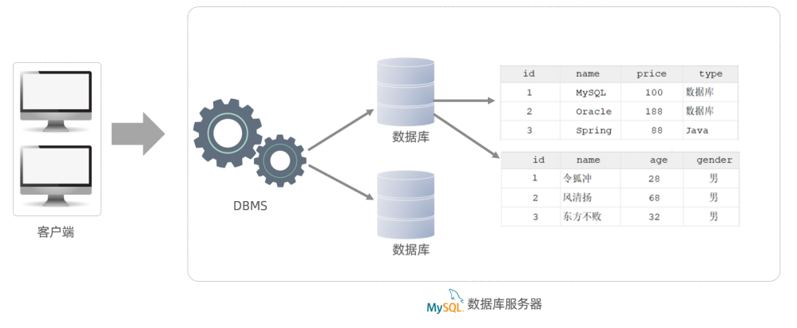

[toc]

# 数据库

| 名称           | 全称                                                         | 简称                             |
| -------------- | ------------------------------------------------------------ | -------------------------------- |
| 数据库         | 存储数据的仓库，数据是有组织的进行存储。                     | DataBase(DB)                     |
| 数据库管理系统 | 操纵和管理数据库的大型软件。                                 | DataBase Management System(DBMS) |
| SQL            | 操作关系型数据库的编程语言，定义了一套操作关系型数据库统一**标准。** | Structured Query Language(SQL)   |

## 数据模型

### 关系型数据库(RDBMS)

> ​	**关系型数据库(RDBMS)**：建立在关系模型基础上，由多张相互连接的二维表组成的数据库。
>
> ​	**二维表**：指的是由行和列组成的表。类似于Excel表格数据，有表头、有列、有行，还可以通过一列关联另外一个表格中的某一列数据。
>
> ​	MySQL、Oracle、DB2、SQLServer 这些都是属于*关系型数据库*，里面都是基于二维表存储数据的。
>
> ​	简单说，基于二维表存储数据的数据库就成为*关系型数据库*，不是基于二维表存储数据的数据库，就是非关系型数据库。
>
> ​	**特点：**
>
> ​		1) 使用表存储数据，格式统一，便于维护。
>
> ​		2) 使用 SQL 语言操作，标准统一，使用方便。

### 数据模型

> ​	MySQL 是*关系型数据库*，是基于二维表进行数据存储的，具体的结构图下:
>
> ​	我们可以通过 MySQL 客户端连接*数据库管理系统(DBMS)*，然后通过 DBMS 操作数据库。
>
> ​	可以使用SQL语句，通过数据库管理系统操作数据库，以及操作数据库中的表结构及数据。
>
> ​	一个数据库服务器中可以创建多个数据库，一个数据库中也可以包含多张表，而一张表中又可以包含多行记录。

# MySQL 安装

# MySQL 体系结构

