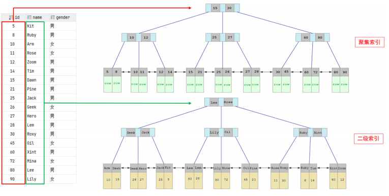
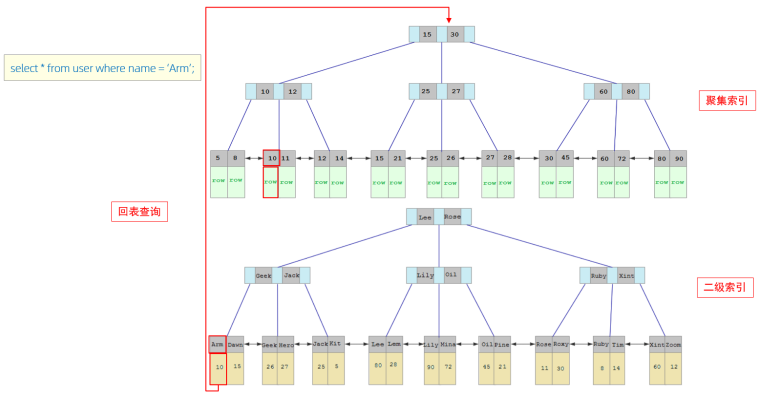
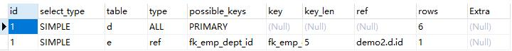

[toc]

# 索引

## 概述

> **索引(index):**
> 	是帮助 MySQL *高效获取数据*的数据结构(有序)。

### 索引的特点

| 优点                                                         | 缺点                                                         |
| ------------------------------------------------------------ | ------------------------------------------------------------ |
| 提高数据检索的效率，降低数据库的 IO 成本。                   | 索引列也要占用空间。                                         |
| 通过索引列对数据进行排序，降低数据排序的成本，降低 CPU 的消耗。 | 索引极大地提高了查询的效率，同时也降低了更新表的速度。<br />如: 对表进行 INSERT、UPDATE、DELETE 时，效率降低。 |

## 索引的结构

### 概述

> ​	MySQL 的索引是在存储引擎层实现的，不同的存储引擎有不同的索引结构。
>
> ​	主要包含以下几种：

| 索引结构            | 说明                                                         |
| ------------------- | ------------------------------------------------------------ |
| B+Tree 索引         | 最常见的索引类型，大部分引擎都支持 B+ 树索引。               |
| Hash 索引           | 底层数据结构是用哈希表实现的，只有精确匹配索引列的查询才有效, 不支持范围查询。 |
| R-tree(空间索引）   | 空间索引是 MyISAM 引擎的一个特殊索引类型，主要用于地理空间数据类型，通常使用较少。 |
| Full-text(全文索引) | 是一种通过建立倒排索引,快速匹配文档的方式。类似于`Lucene, Solr, ES`。 |

### 不同的存储引擎支持的索引结构

> 注意：
> 	我们平常所说的索引，如果没有特别指明，都是指 B+ 树结构组织的索引。

| 索引                | InnoDB           | MyISAM | Memory |
| ------------------- | ---------------- | ------ | ------ |
| B+Tree 索引         | 支持             | 支持   | 支持   |
| Hash 索引           | 不支持           | 不支持 | 支持   |
| R-tree(空间索引）   | 不支持           | 支持   | 不支持 |
| Full-text(全文索引) | 5.6 版本之后支持 | 支持   | 不支持 |

### 为什么 InnoDB 存储引擎采用 B+Tree 索引结构？

1. 相对于二叉树，B+Tree 的层级更少。
2. 对于 B-Tree，不论是叶子节点，还是非叶子节点，都会保存数据。
   这样导致一页中存储的键值减少，指针跟着减少。
   要同样保存大量数据，只能增加树的高度，导致性能降低。
3. 相对 Hash 索引，B+tree 支持范围匹配及排序操作。

## 索引的分类

### 索引分类

| 分类 | 含义 | 特点 | 关键字 |
| -------- | -------- | -------- | ---------- |
| 主键索引 | 针对于表中主键创建的索引 | 默认自动创建, 只能有一个 | PRIMARY |
| 唯一索引 | 避免同一个表中某数据列中的值重复 | 可以有多个 | UNIQUE |
| 常规索引 | 快速定位特定数据 | 可以有多个 |  |
| 全文索引 | 全文索引查找的是文本中的关键词，而不是比较索引中的值 | 可以有多个 | FULLTEXT |

### 聚集索引 & 二级索引

| 分类                                    | 含义                                                       | 特点                     |
| :-------------------------------------- | :--------------------------------------------------------- | ------------------------ |
| 聚集索引(Clustered Index)               | 将数据存储与索引放到了一块，索引结构的叶子节点保存了行数据 | 必须有,而且只<br/>有一个 |
| 二级索引(Secondary Index): 又称辅助索引 | 将数据与索引分开存储，索引结构的叶子节点关联的是对应的主键 | 可以存在多个             |

#### 聚集索引的选取规则：

- 如果存在主键，主键索引就是聚集索引。

- 如果不存在主键，将使用第一个唯一（UNIQUE）索引作为聚集索引。

- 如果表没有主键，或没有合适的唯一索引，则 InnoDB 会自动生成一个 rowid 作为隐藏的聚集索

  引。

#### 聚集索引 & 二级索引的区别



- 聚集索引的叶子节点下挂的是这一行的数据 。
- 二级索引的叶子节点下挂的是该字段值对应的主键值。

#### 执行流程探讨

> 执行`select * from user where name = “Arm”`。
>
> ​	**回表查询：**
> ​		这种先到二级索引中查找数据，找到主键值，然后再到聚集索引中根据主键值，获取数据的方式，就称之为回表查询。



1. 由于是根据 name 字段进行查询，所以先根据`name='Arm'`到 name 字段的二级索引中进行匹配查找。但是在二级索引中只能查找到 Arm 对应的主键值 10。
2. 由于查询返回的数据是 *，所以此时，还需要根据主键值 10，到聚集索引中查找 10 对应的记录(回表查询)，最终找到 10 对应的行 row。
3. 最终拿到这一行的数据，直接返回即可。

## 索引的语法

### 1) 创建索引

```mysql
create [unique | fulltext] index i_name on t_name(index_col_name, ...);
```

### 2) 查看索引

```mysql
show index from t_name;
```

### 3) 删除索引

```mysql
drop index i_name on t_name;
```

## SQL 性能分析

### SQL 执行频率

> ​	MySQL 客户端连接成功后，通过`show [session | global] status`命令可以提供服务器状态信息。
>
> ​	通过如下指令，可以查看当前数据库的`INSERT、UPDATE、DELETE、SELECT`的访问频次：

```mysql
# session: 查看当前会话; global: 查看全局数据。
show [session | global] status like 'Com_______';
```

> ​	通过上述指令，我们可以查看到当前数据库到底是以查询为主，还是以增删改为主，从而为数据库优化提供参考依据。
>
> ​	如果是以增删改为主，我们可以考虑不对其进行索引的优化。
>
> ​	如果是以查询为主，那么就要考虑对数据库的索引进行优化了。
>
> ​	那么通过查询 SQL 的执行频次，我们就能够知道当前数据库到底是增删改为主，还是查询为主。假如说是以查询为主，查询的次数可以借助于慢查询日志来查看。

### 慢查询日志

> ​	慢查询日志记录了所有执行时间超过指定参数(`long_query_time`，单位: s，默认 10s)的所有 SQL 语句的日志。
>
> ​	MySQL 的慢查询日志默认没有开启，通过命令 `show variables like ‘slow_query_log;’` 进行查看。
>
> ​	如果要开启慢查询日志，Linux 需要在MySQL的配置文件（/etc/my.cnf）
> ​	Windows 查看基本目录: `select @@basedir;`配置文件(?/my.ini) 中配置如下信息：

```shell
# 开启MySQL慢日志查询开关 
slow_query_log=1 
# 设置慢日志的时间为2秒，SQL语句执行时间超过2秒，就会视为慢查询，记录慢查询日志 long_query_time=2
```

> ​	配置完毕后，重启 MySQL 服务。

```shell
systemctl restart mysqld
```

```bash
net stop mysql
net start mysql
```

### profile 详情

> ​	`show profiles` 能够在做SQL优化时帮助我们了解时间都耗费到哪里去了。通过`have_profiling`参数，能够看到当前MySQL是否支持 profile 操作：

```mysql
select @@have_profiling;

# 通过以下命令，查看是否启动服务
select @@profiling;

# 开启服务
set profiling = 1;
```

### explain

> ​	`EXPLAIN` 或者 `DESC` 命令获取 MySQL 如何执行 `SELECT` 语句的信息，包括在 `SELECT` 语句执行过程中表如何连接和连接的顺序。

```mysql
# 查询员工的姓名、年龄、职位、部门信息（隐式内连接）
EXPLAIN SELECT e.name, e.age, e.job, d.name AS dept 
	FROM emp e, dept d 
	WHERE e.dept_id = d.id;
```



#### 字段的意义

| 字段           | 含义                                                         |
| -------------- | ------------------------------------------------------------ |
| id             | select 查询的序列号，表示查询中执行 select 子句或者是操作表的顺序(id相同，执行顺序从上到下；id不同，值越大，越先执行)。 |
| select_type    | 表示 SELECT 的类型，常见的取值有 SIMPLE（简单表，即不使用表连接或者子查询）、PRIMARY（主查询，即外层的查询）、UNION（UNION 中的第二个或者后面的查询语句）、SUBQUERY（SELECT / WHERE 之后包含了子查询）等。 |
| `type`         | 表示连接类型，性能由好到差的连接类型为: NULL、system、const、eq_ref、ref、range、index、all(全表扫描)。 |
| `possible_key` | 显示可能应用在这张表上的索引，一个或多个。                   |
| `key`          | 实际使用的索引，如果为 NULL，则没有使用索引。                |
| `key_len`      | 表示索引中使用的字节数， 该值为索引字段最大可能长度，并非实际使用长度，在不损失精确性的前提下， 长度越短越好 。 |
| rows           | MySQL认为必须要执行查询的行数，在 Innodb 引擎的表中，是一个估计值，可能并不总是准确的。 |
| filtered       | 表示返回结果的行数占需读取行数的百分比，filtered 的值越大越好。 |
| extra          | 额外字段。                                                   |

## 索引的使用

### 最左前缀法则

> ​	如果索引了多列（联合索引），要遵守最左前缀法则。最左前缀法则指的是查询从索引的最左列开始，并且不跳过索引中的列。如果跳跃某一列，索引将会部分失效(后面的字段索引失效)。 

### 范围查询

> ​	联合索引中，出现范围查询(>,<)，范围查询右侧的列索引失效。
> ​	出现范围查询(>=，<=)，范围查询左侧的列索引不会失效。

### 索引失效情况

#### 1) 索引列运算

> ​	在索引列上进行运算操作，索引将失效。

#### 2) 字符串不加引号

> ​	字符串类型的字段使用时不加引号，索引将失效。(存在隐式类型转换)

#### 3) 模糊查询

> ​	如果是尾部模糊匹配，索引不会失效。如果是头部模糊匹配，索引则会失效。

#### 4) or 连接条件

> ​	用 or 分割开的条件。如果 or 前的条件中的列有索引，而后面的列中没有索引，那么涉及的索引都不会被用到。

#### 5) 数据分布的影响

> ​	如果 MySQL 评估使用索引比全表更慢，则不使用索引。

### SQL 提示

> ​	SQL提示，是优化数据库的一个重要手段，简单来说，就是在SQL语句中加入一些人为的提示来达到优化操作的目的。

#### use index: 

> ​	建议 MySQL 使用哪一个索引完成此次查询（仅仅是建议，MySQL 内部还会再次进行评估）

```mysql
explain select field_list from t_name use index(idx_name) where 条件;
```

#### ignore index:

> ​	忽略指定的索引。

```mysql
explain select field_list from t_name ignore index(idx_name) where 条件;
```

#### force index:

> ​	强制使用索引。

```mysql
explain select field_list from t_name force index(idx_name) where 条件;
```

### 覆盖索引

> ​	覆盖索引是指查询使用了索引，并且需要返回的列，在该索引中已经全部能够找到。
>
> ​	在使用中尽量使用覆盖索引，减少 `select *` 的使用。 

#### extra 的含义

| extra                    | 含义                                                         |
| ------------------------ | ------------------------------------------------------------ |
| using where; using index | 查找使用了索引，查找的数据在索引列中都能找到，所以不需要回表查询数据。 |
| using index condition    | 查找使用了索引，但是需要回表查询数据。                       |

### 前缀索引

> ​	当字段类型为字符串(varchar，text，longtext等)时，有时候需要索引很长的字符串，这会让索引变得很大，在查询时，会浪费大量的磁盘 IO，影响查询效率。
> ​	此时可以只将字符串的一部分前缀，建立索引。这样可以大大节约索引空间，从而提高索引效率。

#### 语法

```mysql
create index idx_name on t_name(clo(n));
```

#### 前缀长度

> ​	可以根据索引的选择性来决定，而选择性是指不重复的索引值（基数）和数据表的记录总数的比值，索引选择性越高则查询效率越高， 唯一索引的选择性是1，这是最好的索引选择性，性能也是最好的。

```mysql
select count(distinct email) / count(*) from tb_user ; 
select count(distinct substring(email,1,5)) / count(*) from tb_user ;
```

### 单列索引与联合索引

> **单列索引：**
> 	即一个索引只包含单个列。
>
> **联合索引：**
> 	即一个索引包含了多个列。

## 索引的设计原则

1. 针对于数据量较大，且查询比较频繁的表建立索引。

2. 针对于常作为查询条件（where）、排序（order by）、分组（group by）操作的字段建立索引。

3. 尽量选择区分度高的列作为索引，尽量建立唯一索引，区分度越高，使用索引的效率越高。

4. 如果是字符串类型的字段，字段的长度较长，可以针对于字段的特点，建立前缀索引。

5. 尽量使用联合索引，减少单列索引，查询时，联合索引很多时候可以覆盖索引，节省存储空间，避免回表，提高查询效率。

6. 要控制索引的数量，索引并不是多多益善，索引越多，维护索引结构的代价也就越大，会影响增删改的效率。

7. 如果索引列不能存储 NULL 值，请在创建表时使用 NOT NULL 约束它。当优化器知道每列是否包含 NULL 值时，它可以更好地确定哪个索引最有效地用于查询。
